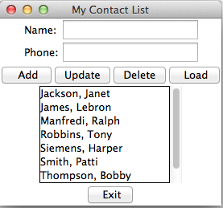
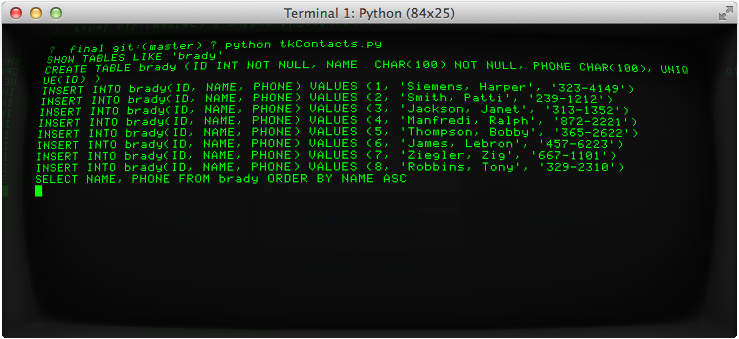

Final Lab
======

### Project

Working with Tkinter (part 2) & a MySQL database

### Objective

To modify your lab 6 program to work with a MySQL database you will create. 

### Project Description

This project will have you create a myDatabase.py file to interact with your existing tkContacts.py file you modified for lab 6.  

Your myDatabasefile.py will include the following functions:

A function to perform the following CRUD operations:

a.	Create a table
b.	Read from the table
c.	Update the table
d.	Delete from the table
e.	Insert into the table

To assist you with SQL on performing CRUD operations go to the following url as a great reference:

(http://www.tutorialspoint.com/python/python_database_access.htm)[http://www.tutorialspoint.com/python/python_database_access.htm]

As noted at the beginning of the tutorial page, you will also need to import MySQLdb libraries to work MySQL with Python. You can grab the API to do so at the following url:

(http://www.lfd.uci.edu/~gohlke/pythonlibs/)[http://www.lfd.uci.edu/~gohlke/pythonlibs/]

and look for the following exe file for windows under the heading…
 ‘MySQL-python is a Python database API 2.0 interface for the MySQL database’.

*MySQL-python-1.2.5.win-amd64-py2.7.exe*

Once downloaded run the exe and you should be good to go!

##### MAC people:

If you have NOT installed MySQL, do so! Link is provided here below:

(http://dev.mysql.com/downloads/mysql)[http://dev.mysql.com/downloads/mysql]

I would recommend the 64bit dmg installer as a download.

Run the installer when you have downloaded the dmg.

Here is the procedure to reset password of root user if you would like to.

1) Stop mysql (Kill mysql process or run following command)

    sudo /usr/local/mysql/support-files/mysql.server stop

2) Start it in safe mode

    sudo mysqld_safe --skip-grant-tables

3) Open another terminal and run the following command (Keep last terminal open)

    mysql -u root

4) Run the following command with suitable new password on the mysql console

    mysql > UPDATE mysql.user SET Password=PASSWORD('password') WHERE User='root';
    mysql > FLUSH PRIVILEGES;

5) Quit from both terminals and open new terminal and connect to mysql with root user and new password

    mysql -uroot -p

Next to download the MySQLdb package go to the following link which will ‘hook’ you up with the MySQL for Python adapter form SourceForge:

(http://sourceforge.net/projects/mysql-python/files/)[http://sourceforge.net/projects/mysql-python/files/]

Click on where is says to _‘Download MySQL-python-1.2.4b4.tar.gz (79.1 kB)’_

Then from the link below follow steps 2, 3 (steps 3b,3c is needed), 5-10 under answer #92 IMPLICITLY to get your library installed and run-(Note- a good idea would be to install Xcode (go to spotlight and type it in) first to help install any necessary tools that may help you with various compiling processes involved with your build & install procedures if you come across any issues along the way)

(http://stackoverflow.com/questions/1448429/how-to-install-mysqldb-python-data-access ibrary-to-mysql-on-mac-os-x)[http://stackoverflow.com/questions/1448429/how-to-install-mysqldb-python-data-access ibrary-to-mysql-on-mac-os-x]

watch step 2- you should have a bit different file name while untarring… perform this command for step 2:

    sh-3.2# tar xzvf MySQL-python-1.2.4b4.tar

(Note I am logged in here as sudo su)

Note if you have IDLE open for testing code at this point to like try to connect to the db from the papa server, shut down IDLE and restart it to get import mods recognized. ☺

#### STEP 1     Instructions to complete this lab:

1.	Create a file called myDatabasefile.py.

Fill it with with the following functions:

a.	A function to create a table
b.	A function to update a table
c.	A function to delete from a table
d.	A function to insert into a table
e.	A function to read records from a table

Perform the necessary SQL for each function definition for each function defined above so when the function is called the proper action will be committed.

When referring to or creating a table use pydb as your database name. Your database table name will be your first name. Your host name will be www.papademas.net.  Your user name will be root and your password will be jamesp for authentication rights into the papasserver.

Example of a connect statement:

    # Open database connection
    db = MySQLdb.connect("127.0.0.1","testuser","testdb","test123" )

Build your table with appropriate column names and data types namely to store the contact information from lab 6. 

2. When completed with your py file, run your app to create your database table and insert the records from your contacts.py file from the last save you performed in lab 6.

#### STEP 2     Adjusting your tkContacts.py file

1.	Adjust any functions you see fit from your tkContacts.py script, so that any updates, deletes, loads, or adds are performed by the said operations defined in your myDatabasefile.py script.
_Note here you don’t really need a ‘Save’ button, unless you deem it worthy to have it somehow, so just delete it from the GUI and any respective callback function defined that’s glued to it._
You see when the user presses your [update] button, your callback function should automatically get passed the right contact information selected by the user which in turn will make the necessary changes to the particular contact record on the server immediately!

2. Keep any remaining functions you deem necessary to have the correct running app, such as makeWindow(), setSelect() and whichSelected(). Your program should ultimately load in all the records your inserted in step 1 into the listbox, similarly to how you had the records load into the listbox from our contacts.py file in lab 6.

#### STEP 3     Running your program and submitting appropriate files & Output

Run your tkContacts.py script and perform the following functions:

1. Add in one record, namely your personal name and a desired contact phone number. 
2. Make a change to your contact number.
3. Delete any record from your contact list.

Take snapshots and place them into a pdf or Word document as follows for full credit:

-Your interface at runtime 
-Initial snapshot of ENTIRE listbox of contacts at runtime
-Show a contact being added via a print statement to the IDLE shell
-Show a contact being changed via a print statement to the IDLE shell
-Show a contact being deleted via a print statement to the IDLE shell

*Note- be descriptive when you include print statements to the shell.  For example; include the contact name being just added in the print statement.*

Further examples:

    Brady House has been just added to the database.
    Brady House has had a contact number changed to xxx-xxxx
    etc.

###### Grads include as snapshots

-Your print out of a contact number change stating the old contact number and the new contact number
-A message box confirming asking the user ‘Are you sure you want to delete from the database the contact name’  - what ever the contact name maybe that’s selected.
-Include try blocks to check for possible errors that should be trapped given various CRUD operations.

###### Extra credit for all.

Include commit and rollback logic to rescue input errancies. Example maybe an update or delete that occurred but needs to be undone.

### Sample Output

#### Main Form

#### Console

### Completed Assignment

[final.pdf](final.pdf)

### Grade

?/50

### Feedback

??

