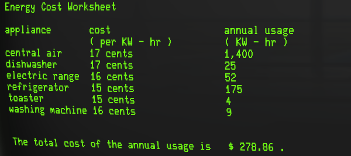

Lab 1
======

### Objective

To write program calculates kilowatt - hour electrical appliance usage.

### Project Description

Write a program that calculates the annual cost of running various appliances.  For each appliance, the program will request that the user enter the cost per kilowatt - hour and the number of kilowatt - hours the appliance uses in a year.

When you purchase electricity you are charged by the kilowatt - hour ( kWh ).  For example, when you use 1,000 watts for 1 hour, that is one kilowatt - hour.

### Sample Output

### Completed Assignment

[lab1.pdf](lab1.pdf)

### Grade

50/50

### Feedback

6/15/14 11:46 AM
Nice!
