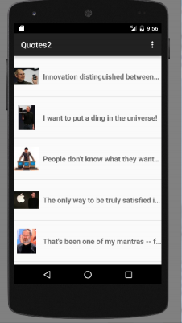
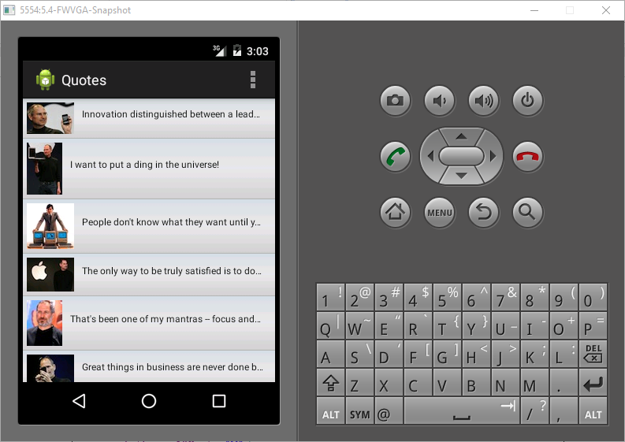
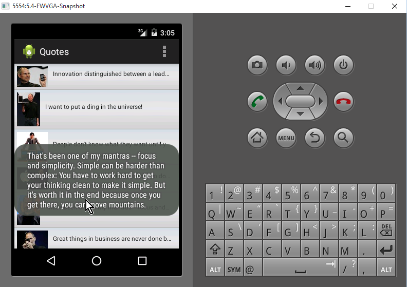

HW3
======

### Instructions

Please create an Android app using ListView. The UI should looks like the following screenshot. It should
contain an ImageView and TextView. 

### Solution

#### Startup 

#### Item Selection (click)

### Completed Assignment

[readme.pdf](readme.pdf)
