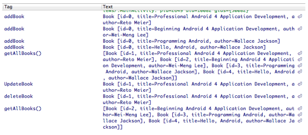
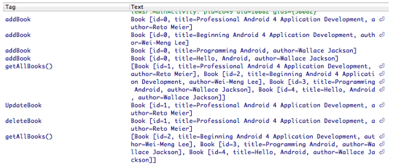

HW6
======

### Introduction

This lab will have you run through stand operations of creating, reading, updating, and deleting from a database. This concept is know as CRUD which stands for create, read, update and delete). 

### Objective

For this lab you will create a database called books and use various methods to interact with the database to thus read, update and delete from the database, etc. All activities on the dbase will be logged and thus viewed in LogCat. A sample output shows as follows:

As you will see when you run your app, the user will press the Display Results button to
see if their answer is correct depending if they clicked on the True vs. False button. An
answer of Right! or Wrong! will then appear briefly in a Toast message. The user will then
press the Next image and then the next question will appear at the top in a TextView to try
another question. At the very end a rating bar will appear showing the number of questions
they have correct denoted by Blue Stars.

### STEP 1 Creating a New Android Project

* Create a new project called BookReviews.
* Create your first activity and call it MainActivity. Use the default layout name

### STEP 2 Create a class in your package called Book.

This class merely will provide the necessary “getters/setters” from a derived book object you will eventually create. The class will be a springboard to help hold the database data thus you will see the relevant data members created for interacting with the three columns of the dbase and various getter/setter methods to interact with the Book class that allows for setting data and getting data to and from the class.

Enter code in as follows:

	package hw6.itm455.iit.com.bookreviews;

	public class Book {
    	private int id;
    	private String title;
    	private String author;

    	public Book() {
    	}

	    public Book(String title, String author) {
    	    super();
        	this.title = title;
        	this.author = author;
	    }
    	//getters & setters

	    public int getId() {
    	    return id;
    	}

	    public void setId(int id) {
    	    this.id = id;
    	}

	    public String getTitle() {
    	    return title;
    	}

	    public void setTitle(String title) {
    	    this.title = title;
    	}

	    public String getAuthor() {
    	    return author;
    	}

	    public void setAuthor(String author) {
    	    this.author = author;
    	}

	    @Override
    	public String toString() {
        	return "Book [id=" + id + ", title=" + title + ", author=" + author
                + "]";
	    }
	}

### STEP 3 Create a new class called SqlHelper that extends the functionality of SQLiteOpenHelper.

The recommended method in creating a new SQLite database is to create a subclass of SQLiteOpenHelper and override the onCreate() method, in which you can execute a SQLite command to create tables in the database.

The functionality of the class is thus Create a new class SqlHelper extends SQLiteOpenHelper.  SqlHelper constructor must call the super class constructor.  Override onCreate() method to create the table(s).  Override onUpgrade() to drop old tables and create new ones.

Let’s begin by coding the class and we’ll go over the relevant coding syntax and logic after. Include the following code into your helper class:

Here are your needed import statements:

	import java.util.LinkedList;
	import java.util.List;
	import android.content.ContentValues;
	import android.content.Context;
	import android.database.Cursor;
	import android.database.sqlite.SQLiteDatabase;
	import android.database.sqlite.SQLiteOpenHelper;
	import android.util.Log;

Here is the starter code:

	public class SqlHelper extends SQLiteOpenHelper {
		// Database Version
 		private static final int DATABASE_VERSION = 1;
 		// Database Name
 		private static final String DATABASE_NAME = "BookDB";
 		// Books table name
 		private static final String TABLE_BOOKS = "books";

		// Books Table Columns names
 		private static final String KEY_ID = "id";
 		private static final String KEY_TITLE = "title";
 		private static final String KEY_AUTHOR = "author";
 		public SqlHelper(Context context) {
 			super(context, DATABASE_NAME, null, DATABASE_VERSION);
 		}
 		@Override
 		public void onCreate(SQLiteDatabase db) {
 			// SQL statement to create book table
 			String CREATE_BOOK_TABLE = "CREATE TABLE books ( " +
 			"id INTEGER PRIMARY KEY AUTOINCREMENT, " +
 			"title TEXT, "+
 			"author TEXT )";
 			// create books table
 			db.execSQL(CREATE_BOOK_TABLE);
 		}
	 	@Override
 		public void onUpgrade(SQLiteDatabase db, int oldVersion, int newVersion) {
 			// Drop older books table if existed
 			db.execSQL("DROP TABLE IF EXISTS books");
 			// create fresh books table
 			this.onCreate(db);
 		}

 		/*CRUD operations (create "add", read "get", update, delete) */
 		public void addBook(Book book){
 			Log.d("addBook", book.toString());
 			// 1. get reference to writable DB
 			SQLiteDatabase db = this.getWritableDatabase();
 			// 2. create ContentValues to add key "column"/value
 			ContentValues values = new ContentValues();
 				values.put(KEY_TITLE, book.getTitle()); // get title
 				values.put(KEY_AUTHOR, book.getAuthor()); // get author
 			// 3. insert
 			db.insert(TABLE_BOOKS, // table
 				null, //nullColumnHack
 				values); // key/value -> keys = column names/values
 			// 4. Close dbase
 			db.close(); 
 		}
 		// Get All Books
 		public List<Book> getAllBooks() {
 			List<Book> books = new LinkedList<Book>();
 			// 1. build the query
 			String query = "SELECT * FROM " + TABLE_BOOKS;
 			// 2. get reference to writable DB
 			SQLiteDatabase db = this.getWritableDatabase();
 			Cursor cursor = db.rawQuery(query, null);
 			// 3. go over each row, build book and add it to list
 			Book book = null;
 			if (cursor.moveToFirst()) {
 				do {
 					book = new Book();
 					book.setId(Integer.parseInt(cursor.getString(0)));
 					book.setTitle(cursor.getString(1));
 					book.setAuthor(cursor.getString(2));
 					// Add book to books
 					books.add(book);
 				} while (cursor.moveToNext());
 			}	
	 		Log.d("getAllBooks()", books.toString());
 			return books; // return books
 		}
 		// Updating single book
 		public int updateBook(Book book) {
 			// 1. get reference to writable DB
 			SQLiteDatabase db = this.getWritableDatabase();
 			// 2. create ContentValues to add key "column"/value
 			ContentValues values = new ContentValues();
 			values.put("title", book.getTitle()); // get title
 			values.put("author", book.getAuthor()); // get author
 			// 3. updating row
 			int i = db.update(TABLE_BOOKS, //table
 				values, // column/value
 			KEY_ID+" = ?", // selections
 			new String[] { String.valueOf(book.getId()) }); //selection args
 			// 4. close dbase
			db.close();
 			Log.d("UpdateBook", book.toString());
 			return i;
 		}
 		// Deleting single book
 		public void deleteBook(Book book) {
 			// 1. get reference to writable DB
 			SQLiteDatabase db = this.getWritableDatabase();
			// 2. delete
 			db.delete(TABLE_BOOKS,
 			KEY_ID+" = ?",
 			new String[] { String.valueOf(book.getId()) });
 			// 3. close
 			db.close();
 			Log.d("deleteBook", book.toString());
 		}
	}

Notice that you have been provided with many functions to perform your CRUD operations. Functions are the
way to go to assist interaction with your MainActivity which can merely call these functions to add, delete, view
or update the database via function calls. Data parameters can be passed in as well to allow for either the
handling of information into the database (ex. manually insert records as this lab demonstrates) or eventually
creating the UI to allow for a user to insert data into the database for example which again can be passed into
the appropriate function in your helper class, namely the addBook method in this case. Notice too that many of
your functions take in a book object that is passed into the parameter list. The object itself can then be utilized
in the implementation really of any your CRUD methods. For example the addBook, deleteBook and updateBook
all take in a Book object which serves to hold the data from the database source!
Note a VERY important line at the very top of your member variable declaration area namely this assignment
statement:

 	// Database Version
 	private static final int DATABASE_VERSION = 1;

This is an interesting declaration and it does a few very important things. For one it calls the onUpgrade
method that is needed in the class which drops a table if it detects a new version or implementation of the
database that is the current version. Actually if you check the parameter list of that function you’ll notice that it
tracks or detects a change in version (old version vs. new version) and thus if you CHANGE the version number
in your declaration (shown above) and run your app, a new version kicks in. That’s okay if you do this and you
may have too if things fail on you (SLQexception errors, etc.) or you just want to create a new INSTANCE of the
dbase. You can toggle between versions if you like provided the prior version ran smoothly otherwise you may
be dinged with an error. Further note, as you may run many a successful time your app you will be adding new
records each time (4 records at a time really per the code you’ll soon see added in via your MainActivity file)
unless you comment out that code of course. That’s okay too, but note if your Log shows many records from 
many runs your records will exemplify a differing id (i.e., incremented with a different id as your create
statement set’s the id column to autoincrement) which is perfectly fine.

Study over the CRUD functions and the resident query logic implemented for each CRUD function big time as
that language is the standard for executing SQLite queries. Use it and manipulate it as well as deemed worthy.

### STEP 4 Open up your MainActivity.java file and add in the following:

First add the following imports:

	import java.util.List;
	import android.app.Activity;
	import android.os.Bundle;

Next add the following code into your Activity:

	public class MainActivity extends Activity {
		@Override
		protected void onCreate(Bundle savedInstanceState) {
			super.onCreate(savedInstanceState);
			setContentView(R.layout.activity_main);
 			SqlHelper db = new SqlHelper(this);
 			/** CRUD Operations **/
 			// add Books
 			db.addBook(new Book("Professional Android 4 Application Development", "Reto Meier"));
 			db.addBook(new Book("Beginning Android 4 Application Development", "WeiMeng Lee"));
 			db.addBook(new Book("Programming Android", "Wallace Jackson"));
 			db.addBook(new Book("Hello, Android", "Wallace Jackson"));
			// get all books
 			List<Book> list = db.getAllBooks();
			// update one book
 			int j = db.updateBook(list.get(0));
 			// delete one book
 			db.deleteBook(list.get(0));
 			// get all books
 			db.getAllBooks();
		}
	}

Notice how your MainActivity is really the driver to trigger your CRUD methods. A List is first created to gather the database
data into the list itself via the SqlHelper db object which is instantiated to work the CRUD operations off the database.

As the List now holds the database data it becomes display its calling of the getAllBooks()method.
Further note the calling to update a book from the database as well as the deleting of a book form the database. We will
discuss that logic in the next step.

### STEP 5 Run your code.

Run your code and check your log files to see if your app has added records to the database
as well as deleted a record and updated a record from the dbase as well. To check your log
file data go to Window > Show View > Other... > LogCat in Eclipse. If you ever have a
blank LogCat screen during runtime, try resetting it by doing Window > Reset Perspective...
and click on Yes to the dialog box. Your LogCat should display something similar to the
following snapshot (shown below in debug mode).

Notice carefully what is going on with the display:

1. Four times addBook was called from the MainActivity to render 4 records into the books database.
2. getAllBooks() was called to display the 4 records that were entered in.
3. UpdateBook was called to update something...? Well if you notice from the log file display it really didn’t update technically anything that didn’t already exist. NOTICE the id number associated with the update query (id=1). Why do you think this is so? Trace your code and you will hopefully see why!!!
4. deletebook was called to delete id=1 from the database which you will see from the final call in your MainActivity was successful!

MODIFY YOUR CODE IN THE APPROPRIATE AREA TO INCLUDE YOUR NAME IN THE LOG FILE TO
APPEAR BEFORE THE INFORMATION OF THE DATABASE TRANSACTION LISTED ABOVE APPEARS.
RERUN YOUR APP AND SNAPSHOT YOUR LOGCAT FILE SHOWING YOUR NAME AND THE RELEVANT
TRANSACTIONAL INFORMATION THAT IS SHOWN ABOVE.

### STEP 6 To finish, modify your code as follows:

For this last step you will modify your app in a twofold manner. For one you will update truly a
particular record and two your will show a count of records as well. Update your 4th record namely the author’s name to Ben Jackson. 

You see there was a mistake in the code purposely when it was added in so you can learn to update a 
part of a record! J To update your record adjust your coding in two areas.

1. In your SqlHelper.java file adjust your updateBook method to take in the following parameters. Notice that the function now takes in a newTitle and newAuthor as additional parameter values. This will serve as data that can be used to truly update a particular record when called from your MainActivity file.
Of course your method needs to do something with the data passed in, so adjust some of the implementation, namely your Content Values to reflect the variables passed. Also set the book id to reflect id # 4 as part of your selection args provided that is the only record that reflects this text title when you run your app.
Next in your MainActivity.java file adjust your call to the updateBook to correctly call the method with the new parameters to be passed. Pass the appropriate values of Hello, Android and Ben Wallace to correctly update the author’s name for the 4th record, whose text is appropriately called Hello, Android.
No need to adjust any log information here for display purposes as the information will still trigger fine showing the new results. RERUN YOUR APPLICATION AND SNAPSHOT YOUR LOGCAT FILE SHOWING THE UPDATED INFORMATION.

		public int updateBook(Book book, String newTitle, String newAuthor)

2. Show a count of the database records at the end of your LogCat file. Include the following method stub into an appropriate area in your app for the retrieval of the record count. Include this as your last method in your MainActivity along with a Log.d issuance to display the total record count along with an appropriate label.  RERUN YOUR APPLICATION AND SNAPSHOT YOUR LOGCAT FILE SHOWING ALL YOUR TRANSACTIONAL INFORMATION INCLUDING YOUR TOTAL RECORD COUNT.  Include all your program files in Word as well as all your snapshots. Also zip your package files too and send your results into BB.

		public int getIds(Book book) {
			String selectQuery = "SELECT id FROM books";
			SQLiteDatabase database = this.getReadableDatabase();
			Cursor c = database.rawQuery(selectQuery, null);
			c.moveToFirst();
			int total = c.getCount();
			return total;
		}

### Completed Assignment

[readme.pdf](readme.pdf)
