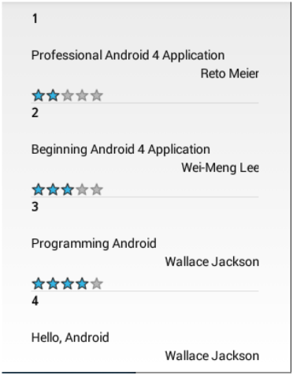
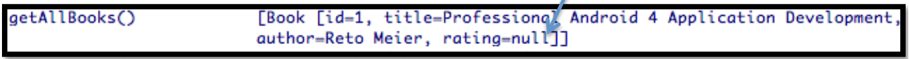
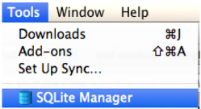
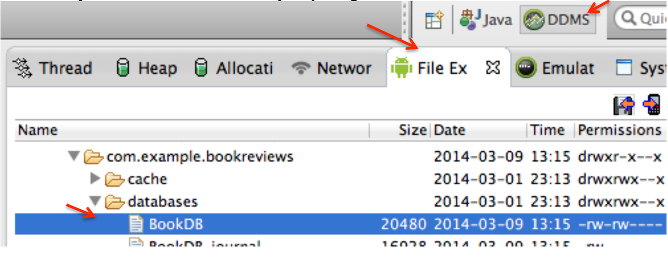
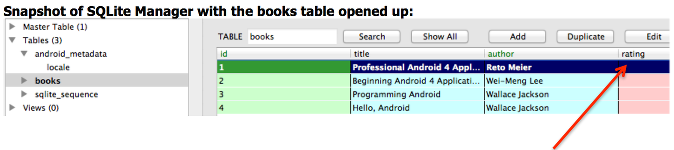
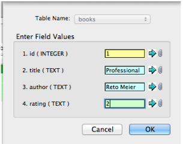
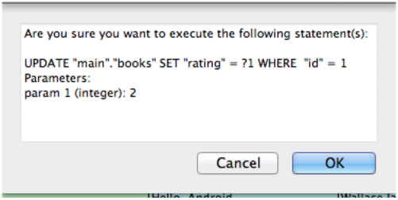
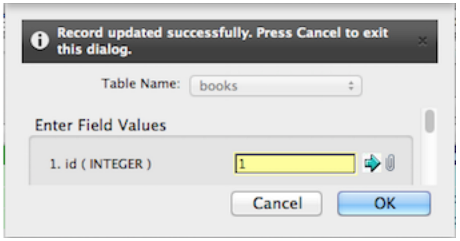

HW7
======

### Introduction

This lab will have you continue your work from lab 6. This time around you’ll present the 
Books database to the user. You will also be adding in a column in code to your database 
as well that will allow for book ratings to be possible. Also included in this lab is the
use of a FF plug-in called SQLite Manager to allow for updates to your table. Finally a 
custom adapter will be created in your code to allow for a listview and objects such as a 
rating bar to display data to the user in the form of text and graphics. 

### Objective

For this lab you will continue working with the books database with some slight modifications 
to the database involving adding in a rating column to the table. You will populate the new
column entry manually in SQLite Manager which is included as a plug-in thru FireFox. Then
you will show off your database via a custom list adapter which will allow you to include both 
text and some graphics to the screen. 

Activities of your app will be further looked at in LogCat. An initial sample output of your app is shown below:

### STEP 1 Open up your last project you created for lab 6

Open up your Book.java file and include the following additions.

Declare another class variable called rating as follows:

	private String rating;

Add in another getter/setter your class as follows:
	
	public void setRating(String rating) {
		this.rating = rating;
	}
	public String getRating() {
		return rating;
	}
	
Adjust your toString()method at the bottom to include your rating to show up in your LogCat file as follows:

	@Override
 	public String toString() {
 		return "Book [id=" + _id + ", title=" + title + ", author=" + author + ", rating=" + rating + "]";
 	}

### STEP 2 Setup layouts for a custom view effect.

Create an xml file called itemlistrow and enter the following code:

	<?xml version="1.0" encoding="utf-8"?>
		<LinearLayout xmlns:android="http://schemas.android.com/apk/res/android"
 			android:layout_width="fill_parent"
 			android:layout_height="fill_parent"
 			android:orientation="vertical" >
 			<TextView android:textColor="#000"
 				android:id="@+id/_id"
				android:layout_width="fill_parent"
				android:layout_height="wrap_content"
				android:text="id" android:textStyle="bold"
 				android:gravity="left"
 				android:layout_weight="1"
 				android:typeface="monospace"
				android:height="40sp" />
 			<TextView android:textColor="#000"
 				android:id="@+id/title"
				android:layout_width="fill_parent"
				android:layout_height="wrap_content"
				android:text="title"
 				android:layout_weight="1"
 				android:height="20sp" />
 			<TextView android:layout_height="wrap_content"
 				android:layout_width="fill_parent"
 				android:layout_weight="1"
 				android:textColor="#000"
				android:gravity="right"
				android:id="@+id/author"
				android:text="author"
 				android:height="20sp" />
 			<RatingBar
 				android:id="@+id/rating"
 				style="?android:attr/ratingBarStyleSmall"
 				android:layout_width="wrap_content"
 				android:layout_height="wrap_content"
 				android:paddingTop="6dip"
 				android:stepSize="0.25"
 				android:numStars="5"
 			/>
		</LinearLayout>

Modify your activity_main xml file to only include the following markup:

	<LinearLayout xmlns:android="http://schemas.android.com/apk/res/android"
 		xmlns:tools="http://schemas.android.com/tools"
 		android:layout_width="match_parent"
 		android:layout_height="match_parent"
 		android:baselineAligned="false"
 		android:orientation="vertical" >
 		<ListView
 			android:id="@+id/list"
 			android:layout_width="250dp"
 			android:layout_marginTop="10dp"
 			android:layout_marginBottom="10dp"
 			android:layout_height="fill_parent"
 			android:layout_gravity="center" >
 		</ListView>
	</LinearLayout>

These layouts will help you provide data to the screen in the form of a listview plus 
accompanying textviews and a rating bar which will help serve up your record data to the screen.

### STEP 3 Create a class in your package called ListAdapter.

This class will allow for a custom view to be set up to bind text data and a rating bar to the
screen via two layouts and a ListAdapter. Enter code for your new adapter class as follows:

	import java.util.List;
	import android.content.Context;
	import android.view.LayoutInflater;
	import android.view.View;
	import android.view.ViewGroup;
	import android.widget.ArrayAdapter;
	import android.widget.RatingBar;
	import android.widget.TextView;

	public class ListAdapter extends ArrayAdapter<Book> {
 		private List<Book> items;

		public ListAdapter(Context context, int textViewResourceId) {
 			super(context, textViewResourceId);
		}
		public ListAdapter(Context context, int resource, List<Book> items) {
 			super(context, resource, items);
 			this.items = items;
		}
		@Override
		public View getView(int position, View convertView, ViewGroup parent) {
 			View v = convertView;
 			if (v == null) {
 				LayoutInflater vi;
 				vi = LayoutInflater.from(getContext());
 				v = vi.inflate(R.layout.itemlistrow, null);
 			}
	 		Book p = getItem(position);
 			if (p != null) {
 				TextView tt = (TextView) v.findViewById(R.id._id);
 				TextView tt1 = (TextView) v.findViewById(R.id.title);
 				TextView tt3 = (TextView) v.findViewById(R.id.author);
				RatingBar rb = (RatingBar) v.findViewById(R.id.rating);
 				if (tt != null) {
 					tt.setText("" + p.getId());
 				}
 				if (tt1 != null) {
 					tt1.setText(p.getTitle());
				}
 				if (tt3 != null) {
 					tt3.setText(p.getAuthor());
 				}
 				if (rb != null) {
 					float rating = Float.parseFloat(p.getRating());
 					rb.setRating(rating);
			 	}
 			}
 			return v;
		}
	}

What this code roughly does is retrieve the id’s defined in your itemlistrow layout and allows for textviews
and a rating bar to take on record values displayable in a custom view till there are no more records to be read
via your buddy, the ‘Book’ class.

### STEP 4 Modify your SqlHelper class to include an additional column called rating

In your onCreate(SQLiteDatabase db)function adjust your CREATE TABLE command to include an extra column to your books talbe named rating as follows:

	String CREATE_BOOK_TABLE = "CREATE TABLE books ( " +
 		"id INTEGER PRIMARY KEY AUTOINCREMENT, " +
 		"title TEXT, "+
 		"author TEXT, "+
 		"rating TEXT)";

Be weary at this point as only when there is a change in the database version will this method fire and therefore perform the command. So you would have to adjust
this when it comes time to testing your app and will have to change the Database version when it’s time to execute the above query to build a new table.

(More on this to come!)

### STEP 5 Open up your MainActivity.java file and add in the following:

In your class code after the line db.getAllBooks(); include the following code:

	ListView listContent = (ListView) findViewById(R.id.list);
	List<Book> books = new ArrayList<Book>();
	books=db.getAllBooks();

	//get data from the table by the ListAdapter
	ListAdapter customAdapter = new ListAdapter(this, R.layout.itemlistrow, books );
	listContent.setAdapter(customAdapter);

I would also comment out the db.deleteBook(list.get(0)); line you have to allow for all books to be displayed.

That’s basically it for now. Here you added in code to call the ListAdapter constructor you created which will help
inflate the custom view you defined consisting of the itemlistrow layout. By default your activity_main layout
inflates at start up which defined your listview and thus the custom layout intertwines with that layout creating a
view override which shows itemlistrow objects to be displayed in a row by row fashion within the listview. How
cool is that?

### STEP 6 Run your code.

Now for some tweaks. You need to run your code twice to allow for your table to be rebuilt with
your added new column to execute and another run for the actual display to trigger. You see
as you are adding a column, namely rating, to your table, when your app runs it won’t see
anything but null values for each record concerning your rating column. That does present a
problem for display purposes as well as an app that will crash on your initial run as you will see

Okay- unhook any commented code if you have any in MainActivity that block out your add
statements as you will be rebuilding from scratch your dbase for this exercise. Next go to your
SQLHelper file and change your current database version to the next number. For example if
you have your private static final int DATABASE_VERSION = 8; change it to 9.

Okay, run your app. It will crash. But that’s okay. Notice your LogCat file. It should show 4
records were created with the rating field reflecting null values as shown on a partial LogCat
snapshot below: 

Now to rectify this we will now add in values via the SQLite Manager to the rating column so
nulls will not exist the next time you run your app. Of course you could of added in rating values
in your add method in MainActivity or ran update queries to add in values to your rating column
in code but that would be no fun and it wouldn’t give you a chance to work the SQLite Manager. 

### STEP 7 Download SQLite Manager.

Launch FireFox download and install the [SQLite Manager plugin](https://addons.mozilla.org/en-US/firefox/addon/sqlite-manager/).
After you install the plug-in you can open it in FireFox from your Tools menu as shown below. 

Go ahead and open it. Keep the window open and go back to Eclipse to grab your BookDB file
located in your data/data/com.example.bookreviews/databases folder to retrieve your
BookDB database file (as shown below). Make sure to click on your DDMS tab then the File 
explorer tab once your emulator is running to traverse to your database file resident in your package.

Highlight the DB file you want grab and click on the Export icon to export your file to a local designation on
your computer.

Next in SQLite Manager, open up the BookDB file and edit your rating column to include the following values:

Notice your rating column have null values so time to edit them. Double click on the first rating column for
record 1 to edit it. The following pop up window appears (shown next) allowing you to edit the record. Add in
the value of 2 for the rating field. Press OK when complete.

After you click OK a confirmation window pops up. Press okay again to commit.

Now it tells you to press Cancel to exit the dialog box upon a successful update (shown next). Press Cancel at this time. 

Do the same routine for the next three records. For record 2 add a column rating of 3, for record 3 a rating value of 4 and for record 4 a rating of 1. 
Okay your database table has been automatically updated in the spot where you saved it to locally. Go back to your File Explorer in Eclipse and 
import your DB file back into your folder with the path: data/data/com.example.bookreviews/databases by pressing your import button 
at the top right hand side of your IDE namely the icon. Locate your local DB file and import it back in. Take a snapshot of your SQLite 
Manager to show your completed table entries.

### STEP 8 Run your code again.

Now before running your app again go back to your MainActivity file and comment out your add 
statements as you don’t need to add in anymore records on subsequent runs. Run your app and 
you should now see a display on your screen with all the database records include title, 
author, id and a rating for each record! Take a snapshot to show your completed interface 
showing the listview in your emulator.

### STEP 9 Modify your app as follows

Include an image of each textbook listed in your database (grab a reasonably sized
image (could be a facsimile of the text) by googling its title) and add it to your display in place
of the id that shows in the listview. Include edit points where applicable. Include images in an
appropriate res/drawable folder and adjust your applicable layout xml file to reflect an
imageview as well as adjust your code in any appropriate java files you deem necessary
(namely ListAdapter.java for one) to allow for images to be fed into your display. If you feel
you have to add in a column to your database table to store the image title for each
record that may not be a bad idea, that way when you cycle thru your custom view
to build an appropriate view it may seem logical to point to each database table record to fetch
the image name and thus have it rendered appropriately into your custom view.

Example: 

	p.getImageName() //get image name from table column

Coding logic furthers here as an example:

	ImageView icon=(ImageView)row.findViewById(R.id.icon);
 	if (p.getImageName().equals(“profAndroidimg”){
 		icon.setImageResource(R.drawable.profAndroidimg);
 	}
 	
 	//etc...

Take a snapshot to show your completed interface showing the listview now including your textbook images in your emulator.
Include all your program files in Word as well as all your snapshots. Also zip your package files too and send your results into BB.

### Completed Assignment

[readme.pdf](readme.pdf)
