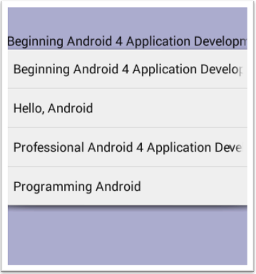
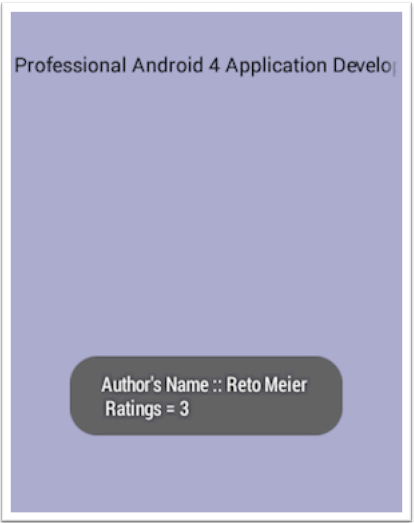

HW8
======

### Introduction

This lab will have you continue your work from lab 7. This time around you’ll allow the 
user, via a Spinner dropdown control to act as a data bound control, to search for a 
particular text by title from your database table, select a choice text and trigger a 
response back to the user displaying the text’s author and rating based the user’s choice.

### Objective

For this lab you will continue working with the books database with some slight
modifications to the database involving adding a Spinner control to allow ease of 
searching the database by title. You will modify your SqlHelper file by adding in a few 
more getter methods. Likewise you will add in a xml file for your spinner control to 
render as well as any settings to enhance the look and feel of the control. MainActivity 
also will be modded to allow for UI with the added spinner control. Your job will be to 
run a query off the spinner control which will render the titles from your database and
return the author and rating from a particular chosen title by the user.

Sample starter snapshots are shown below:

1. Choose an item from the spinner pull down control

	

2. Result of choice displayed

	

### STEP 1 Open up your last project you created for lab 7 and add in the following xml file to your layout folder.

Create a spinner.xml file and add in the following tag to allow for the spinner control to appear in your initial UI screen.

	<Spinner
		android:id="@+id/spinner1"
		android:layout_width="match_parent"
		android:layout_height="wrap_content"
		android:drawSelectorOnTop="true" />
		
### STEP 2 Add some getter/setter methods to your SqlHelper file.

Open up your SqlHelper file and add the following methods before the end of your class. 
These methods will be soon called in your MainActivity which you will modify in the next step. 

	public Set<String> getTitle() {
        Set<String> set = new HashSet<String>();
        String selectQuery = "select *   from    " + TABLE_BOOKS;
        SQLiteDatabase db = this.getReadableDatabase();
        Cursor cursor = db.rawQuery(selectQuery, null);
        if (cursor.moveToFirst()) {
            do {
                set.add(cursor.getString(1)); 
            } while (cursor.moveToNext());
        }
        cursor.close();
        db.close();
        return set;
    }

    public String getAuthor(String title) {
        StringBuilder s = new StringBuilder();
        String selectQuery = "select *   from    " + TABLE_BOOKS + "   where   title=?";
        SQLiteDatabase db = this.getReadableDatabase();
        Cursor cursor = db.rawQuery(selectQuery, new String[]{title});
        if (cursor.moveToFirst()) {
            do {
                s.append(cursor.getString(2));
            } while (cursor.moveToNext());
        }
        cursor.close();
        db.close();
        return s.toString();
    }	
	
As you can see the first method returns a title set off your database. We use Set<String> as
a dynamic array because Set doesn’t allow duplicates therefore your Spinner only will show
unique results. Also note your will use Set again in your MainActivity shortly as easily convert 
the Set in List<String>. Then you can easily append data to spinner an ArrayAdapter.
The second method above takes in the title chosen off the Spinner and finds the author’s name 
matched against the title in your table and returns the value to the calling environment.

### STEP 3 Modify your MainActivity file.

Open up your MainActivity file and add the following code additions and adjustments.
Include the following starter information for your class heading, including the class level variables shown:

	public class MainActivity extends Activity implements View.OnClickListener, AdapterView.OnItemSelectedListener {
	    private Set<String> _set;
	    private SqlHelper _db;
	    private boolean _blnFlag = false;
		
Notice your including the OnClickListener to listen for a pull down selection choice from the user.

Note further the SqlHelper	db;	line. This is needed as class variable now to help you interact
with your new methods added in step 2. So please make sure to CHANGE your line in your
onCreate() method now from 

	SqlHelper db = new SqlHelper(this);

to this 

	this._db = new SqlHelper(this);
	
Also in the first few lines in your onCreate() method change from

	setContentView(R.layout.activity_main);
	
to this 

	setContentView(R.layout.spinner);
	
to trigger the new xml file you created in step 1 to reflect the Spinner control on start up.

Next block out your two lines to trigger a customAdapter you worked on for display purposes from
your last lab...comment out these two lines in your onCreate() method:

	//		ListAdapter	customAdapter	=	new	ListAdapter(this,	R.layout.itemlistrow, books	);
	//		listContent.setAdapter(customAdapter);
	
Finally add in the following code under the 2 lines above (or where you deem necessary) in your
onCreate() method

		Spinner spinner;
        spinner = (Spinner) findViewById(R.id.spinner1);
        this._set = this._db.getTitle();
        List<String> blist = new ArrayList<String>(this._set);
        Collections.sort(blist, new Comparator<String>() {
            @Override
            public int compare(String lhs, String rhs) {
                return lhs.compareTo(rhs);
            }
        });
        blist.add(0, "Select title...");
        ArrayAdapter<String> adapter = new ArrayAdapter<String>(MainActivity.this,
                android.R.layout.simple_spinner_dropdown_item, blist);
        adapter.setDropDownViewResource(android.R.layout.simple_spinner_dropdown_item);
        spinner.setAdapter(adapter);
        spinner.setWillNotDraw(false);
        spinner.setOnItemSelectedListener(this);
        
	} //end	onCreate()	method					
	
	@Override
	public void onItemSelected(AdapterView<?> arg0,	View arg1, int arg2, long arg3)	{	
		if( this._blnFlag) { 
            if(position>0) {
                String title = parent.getItemAtPosition(position).toString();
                Toast.makeText(this, "Author's   Name    ::  " + this._db.getAuthor(title),
                        Toast.LENGTH_LONG).show();
            }
        }
        this._blnFlag=true;
	}
	@Override
	public void onNothingSelected(AdapterView<?> arg0) {
		//	TODO Auto-generated	method	stub
	}	
	@Override
	public void onClick(View v) {
		//	TODO Auto-generated	method	stub
	}

Notice the code above adds an initial statement to the blist set of values namely “Select title...” at
the first location in the Spinner. The purpose is to show the user what the Spinner has as choices
and can then allow for a selection the first time around of any valid choices in the Spinner of jus the
titles from choices #2 on. Otherwise the user actually can’t trigger a result by choosing the first item
in the spinner initially! Also notice the boolean flag variable put into play for the onItemSelected
method. This helps detract from a message appearing initially upon start up and only triggers if the
user actually selects a Spinner pull down item – denoted by arg2 (which is really the integer
position result of a particular selection) which should be for only choices > 0 (meaning not the
Select title... choice.

Further note the method calls to getTitle() and getAuthor() in the code above and what actions are
being performed by the getters and setters you added in step 2.

Ok run your app and take an initial screen snapshot of a given result that fires into the Toast
message are. Choose any valid title listed you desire.

If you may be getting errors, check from the imports below you have everything covered.

	import java.util.ArrayList;
	import java.util.Collections;
	import java.util.Comparator;
	import java.util.List;
	import java.util.Set;
	import android.app.Activity;
	import android.os.Bundle;
	import android.view.View;
	import android.view.View.OnClickListener;
	import android.widget.AdapterView;
	import android.widget.AdapterView.OnItemSelectedListener;
	import android.widget.ArrayAdapter;
	import android.widget.ListView;
	import android.widget.Spinner;
	import android.widget.Toast;
	
### STEP 4 Modify your MainActivity file.	

Ok, once your satisfied with things modify your app as follows:

1. Include not only the author’s name in the Toast message, but include a new line for the popup message with the rating value of the particular title chosen as well. You want to include a method in your SqlHelper file in a similar manner of what you added in step 2 to allow for a return value showing the rating result off a query statement.
2. Include a nice background color other that white, to your screen to help differentiate other screens in your app.
3. Add some nice style effects to your Spinner view. You can easily set a theme in your styles.xml file. Here is a sample set of xml tags that you can use to set a slightly smaller font for instance so all of your titles fit apply into the Spinner items displayed. Example add in the following lines to your file and adjust the font sizes and paddings to your liking:

		<!-- For	the	resting	Spinner	style	-->
		<item name="android:spinnerItemStyle">
			@style/spinnerItemStyle
		</item>
		<!-- For	each	individual	Spinner	list	item	once	clicked	on	-->
		<item name="android:spinnerDropDownItemStyle">
			@style/spinnerDropDownItemStyle
		</item>
		
		

Ok run your app again and take a final screen snapshot of all the desired features added above including the new Toast message.
Include all your program files/xml files your added in or modified into Word as well as all your snapshots. 
Also zip your package files too and send your results into BB.	

### Completed Assignment

[readme.pdf](readme.pdf)	