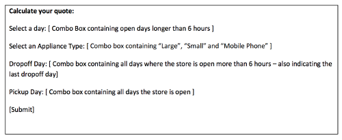

ITM462 Assignment 1
======

## Assignment Instructions & Requirements

This Assignment uses knowledge gained in weeks 1, 2 AND 3. This assignment is worth 12% of your final grade. This assignment is due: Tuesday September 16th 2013 11:59pm Chicago Time. It might take you several hours of work to complete. You will need to make sure you have access to a computer hosting a web server capable of running PHP. I recommend you install WAMP or MAMP (or LAMP) on your personal machine. Any students enrolled in the 562 sections must complete the additional work described in the graduate extension section.

### Introduction

You have been contracted as a web developer for a small appliance repair company: “Reliable Repair” . They charge customers by the hour to repair electronic equipment such as toasters, blu-ray players and televisions. They have a basic website consisting of two pages – an informative page containing basic information about the company and a price quote page where customers can enter basic information to calculate a fair estimate for the work. You are to upgrade the existing static html pages with dynamic content – using only PHP to add the outlined additional functionality:

### Objectives
- Detail the use of PHP variables including arrays
- Demonstrate the use of Web Servers in hosting dynamic content

### Requirements
- Add PHP code to the website that:
- Uses the provided data in the index page to display the opening hours in one of the available sections in table form. The opening hours should be visible for each day the business is open also indicating the last dropoff time for appointments. Dropoff can occur on days where the store is open for longer than 6 hours and the last time for dropoff is 3 hours before store closing. It should look like the following:

- Display the company address on the main page: 1717 N Larrabee St, Chicago, IL 60614-5621 where it should be a clickable link to a website where they might find directions to their location
- Uses the provided data in the quote.php page to display a html form that looks like the following:

### Graduate Extension
If you are involved in any section of 562 you must also add PHP code to the website that displays a calendar of the current month on the quote page, highlighting days the store is open – showing the opening hours on the highlighted days.
Use these PHP functions to aid you in creating a dynamic calendar.

[http://php.net/manual/en/function.getdate.php](http://php.net/manual/en/function.getdate.php)
[http://php.net/manual/en/function.date.php](http://php.net/manual/en/function.date.php)

### Grading Details
You will obtain maximum grades by:
- Making maximum use of variables and control structures to minimize the lines of repeated code needed to display the required elements.
- Writing new code only within the php sections 1-7 as indicated
- Completing all customer requirements
- Submitting on time