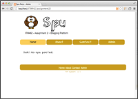
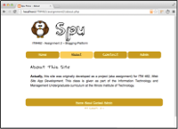
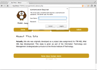
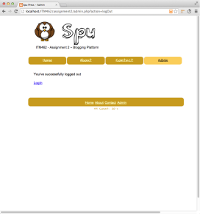
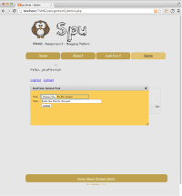
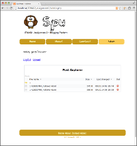
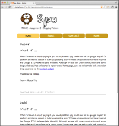

ITM 462 Assignment 2
======

## Assignment Instructions & Requirements

This Assignment uses knowledge gained so far through the course in addition to week 6. This assignment is
worth 12% of your final grade. This assignment is due: Tuesday October 7th 2013 11:59pm Chicago Time. It
might take you several hours of work to complete. You will need to make sure you have access to a computer
hosting a web server capable of running PHP. I recommend you install WAMP or MAMP (or LAMP) on your
personal machine. Any students enrolled in the 562 sections must complete the additional work described in
the graduate extension section.

### Introduction
You are going to build a blogging platform to complete with blogger and wordpress – two leading platforms
in this space. Your blogging platform must offer at least two pages. One administrative page to save new blog
entries and another separate page for outside users to view the last five blog entries.

### Objectives
Explain the role of forms in web site applications
Implement and describe basic security for form processing
Outline the types of resources server applications can connect to and their advantages and disadvantages

### Requirements
- Administrators should be able use the admin section to upload a blog entry that consists of a title andblog text.
- The easiest way to do this might be through a single form that allows all these fields, and saving the blog file into a new folder for each new entry.
- All JavaScript injections to the form should be removed. HTML formatting may or may not be allowed, depending on your discretion.
- Your blogging platform should have a standard layout including a site name and page header on the top of every page.
- The easiest way to do this is to create a set of reusable layout functions that are used on all your pages
- Your blogging platform should allow regular internet users to view up to the last five blog entries on the main page of the website. Each blog entry should clearly show the title, the blog text that the administrator uploaded for that entry.
- This might be best achieved by scanning the directory where you store all blog entries, and loading the files for each blog and displaying them using a custom function
- Blogs entries should be saved in files for safe keeping
- Your blogging platform should also show in a common footer at the bottom of every page the number of times the user has visited any page There should also be a button to reset the count to zero
- This is achieved best with session variables

### Graduate Extension
- Clicking on each blog entry’s title from the user page should display a new page containing only that blog entry.
- This should be using a second .php page, or you could alternatively use a $_GET request on the main index page.
- Administrators should also be able to add an optional image to blog entries
- Add file uploading to the main blog upload on the admin section and save the uploaded image to the same folder as the blog entries
- Users of the main blog site should see the images uploaded with each blog entry if one exists.

### Grading Details
- You will obtain maximum grades by:
- Making maximum use of variables and control structures to minimize the lines of repeated code needed to display the required elements.
- Writing new code only within the php sections 1-7 as indicated
- Completing all customer requirements
- Submitting on time

### Submission Details
- You must upload your submission, including source code inside a zip archive to blackboard by the due date.
- The submission must be in the following format. Failure to produce your assignment in exactly this format will result in a 5% reduction in assignment grade:

### Assignment Submission Format:
- YourLastName_FirstName_IdNumber_AS1.zip
-src (folder)
-ALL documents and folders as required
- README.pdf (describes your submission including problems and additional attributions)
- Please clear any images from your submission before uploading. Your assignment should be less than 5mb
in size.

### Late Policy
- You will lost 10% of your assignment grade (1.2% of course grade) every 24hours that your submission is late, starting from 1minute after the deadline.
- Extensions are given in rare circumstances due to serious illness or family issues and will only be considered up to 48 hours before the deadline and with proof of hardship.

------------------

## Completed Assignment Details

### Installation / Setup
1. Copy the entire assignment directory to the htdocs directory of your apache server
2. Change the read/write settings on the content sub-directory.  This can be done using chmod from the root assignment directory— 

    chmod u+rw,g+rw,o+r content

3. Open the root index.php using chrome
4. To login into the admin page, use username/password “test”/”test”

### Wireframes / Notes

#### Initial Startup (No Posts)

- The “x” link to the right of the Hit Count in the footer section of each page can be used to reset the hit count.  This link can be used from any page in the site to reset the hit count to 1.
- If there are no post files in the contents directory, then application will inform the user of this fact (above).
 
#### About Page

- Static (hard code text) page explaining the purpose of the site.  In this case, welcome to (yet another) waste my time re-write the wheel homework assignment.  Sorry, I am just really (really) getting sick of the _done and done_ homework assignments.
  
#### Admin Login

- Authentication is handled by the admin.php and auth.php, which relies on the browser to open a pop-up. 

#### Admin Logout

- If the auth.php defined logic fails, then the admin.php will not display the file browser panel or upload button.

#### Admin Upload

- On upload, the file-upload.php will—

    1. Create a new file in the content subdirectory with a prefix corresponding to the current epoch time.
    2. The first line of the file will contain the title entered by admin

- There is currently no validation of the title.  However, the file upload only accepts “txt” files.  This validation is based on the file name extension.  If the filename extension is not “txt”, the user is simply bounced back to the admin page.   

#### Admin File Browser

- The file browser component (content/index.php), was adapted from following open-source utility - http://encode-explorer.siineiolekala.net/.  It has been customized for the purpose of this project and is used to list files and delete them. 

#### Home Page (Populated)

- The home page (index.php) iterates the content sub directory and servers up each file as a separate post. It will display the last 5 posts submitted.  The post time stamp is created from epoch time stamp included in file name.  The heading (or title) is taken from the first line of the file, which was added during upload.
