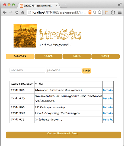
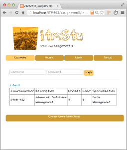
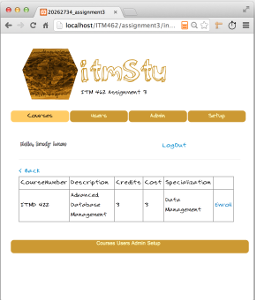
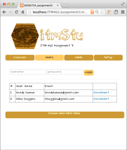
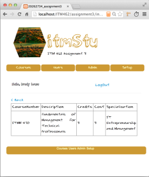
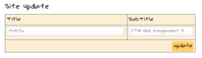
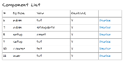

]

## Assignment Details

## System Requirement

1. MySQL running on localhost setup with a "root" admin account with no password
2. PHP 5.3.10 or greater

------------------

## Installation / Setup

1. Copy the entire assignment directory to the htdocs directory of your apache server
2. Start-up MySql
3. Change the read/write settings on the content sub-directory.  This can be done using chmod from the root assignment directory— 

        chmod -R u+rw,g+rw,o+r *

4. Open the root index.php using chrome.  Since the application database does not exist, 
   this will redirect you to the setup component -- index.php?option=setup&view=install. This view will invoke
   the /content/sql/install.sql script using the localhost/mysql database.  Once it completes, your MySQL instance
   should now be configured with a "house_brady_20262734_assignment3" database.  After running the script,
   the setup component will display the message "house_brady_20262734_assignment3 database created successfully."
   
5. You should now be able to re-open the root index.php, which should by default redirect you to the course list view,
   "index.php?option=store&view=courselist.

------------------

## Data Model

]

### Database Script

[content/sql/install.sql](content/sql/install.sql)

- **Note, for best results use the setup utility - [index.php?option=setup&view=install](index.php?option=setup&view=install)**

### Test Accounts

#### Admin User Account

        login: bhouse
        password: 33November

- After login, this account can access the [Admin Component](index.php?option=admin&view=comlist)

#### Non-Admin User Account

        login: bbaggins
        password: January44

- After login, this account cannot access the [Admin Component](index.php?option=admin&view=comlist)
- They will receive a _401 - Not Authorized_ if they try accessing the component

### How To Add a User

Using the MySqlAdmin, run the *stu_user_i* stored procedure--

        SET @p0='John Doe'; SET @p1='professor'; SET @p2='password'; SET @p3='johndoe@nomail.com'; SET @p4='word'; SET @p5='0'; CALL `stu_user_i`(@p0, @p1, @p2, @p3, @p4, @p5);

- To give the user admin privileges, set the isAdmin bit to "1".  
- **The current admin component does not provide any built support for adding user.  It assumed that the owner of the site can easily run the stu_user_i or stu_user_u stored procedures using the MySqlAdmin interface. It should also be noted (per the requirements above), there was no requirement for integrated user CRUD operations.**

### How to Update a User

Using the MySqlAdmin, run the stu_user_u stored procedure--

        SET @p0='bhouse'; SET @p1='brady house'; SET @p2='33wonder'; SET @p3='brady@houseknecht.com'; SET @p4='word'; SET @p5='0'; SET @p6='0'; CALL `stu_user_u`(@p0, @p1, @p2, @p3, @p4, @p5, @p6);

- **Note - You cannot change the user's login since this value is used lookup the stu_user record.**
   
------------------

## Components

## Courses Component

- Component Link: [index.php?option=course&view=list](index.php?option=course&view=list)
- No authentication is required to access this component
- Authentication is required to use the enroll feature of the detail view (see below)
- After the setup process is complete, this is default view for the application 
- Opening the [index.php](index.php) will redirect the browser to the Course

### List View

- Component View Link: [index.php?option=course&view=list](index.php?option=course&view=list)
- The page displays the contents of the stu_course table (as per the requirements)
- Clicking the detail link for a given course will open the Detail View

### Detail View

- Component View Link: [index.php?option=course&view=detail&courseId=6](index.php?option=store&view=coursedetail&courseId=6)
- If the user is authenticated and not enrolled in the class, then the page will display an **enroll** link
- If the user is not authenticated then the *enroll* link is not displayed

### Enroll View

- Clicking the **enroll** link from the detail view invokes the stu_user_course_link_i stored procedure
- This procedure adds a record to the stu_user_course_link table
- **Note, once enrolled, a user cannot "un-enroll" (as per the requirements)**

------------------

## User Component

- GET Request [index.php?option=user&view=list](index.php?option=user&view=list)
- No authentication is required to access this component

### User List View

- Page displays the current list of configured users (as per the requirements)
- The enrolled link can be used to open user detail view

### User Enrollment View

- Page displays a list of courses that the user (aka student) is currently enrolled in
- The stu_user_detail_s stored procedure services this component
- This procedure joins the stu_user, stu_course via the stu_user_course_link table
- If the user is not enrolled in any classes, then the page simply displays the table header

------------------

## Admin Component

- Component Link: [index.php?option=admin&view=list](index.php?option=admin&view=list)
- Access to the component requires authentication and that isAdmin bit has been set to true for the user
- If the **isAdmin** bit on the returned record is true, then user is allowed to access the admin component
- Otherwise, they cannot access the component and will receive a 401 (Not Authorized) Error 
- The interface is broken up into two sections (parts)
-- Site Update
-- Component List

### Site Update Form

- This section displays a form that allows the update of the site title and sub title (as per the requirements)
- On POST, the stu_site_u stored procedure is invoked
- This procedure updates the stu_site table
- This section of the admin can be disabled via the component list (see below)
- **Note, all components are effected minus the setup component** 
- **The setup component uses the SETUP_* values defined in the configuration.php script**
- **This represents an obvious hole, and if I weren't a lowly undergrad I might request an extension to fix**

### Component List 

- Components are listed by their option / view combination
- The user can turn components on or off by clicking the enable/disable link (as per the requirements)
- Component state is based on the stu_component table's "isEnabled" flag
- Clicking "enable" (or "disable") invokes the stu_component_u procedure which updates the stu_component table
- **Note, its possible to turn off everything except for the course list. Turning off course list, will disable 
  the "course list" link visible at the top and bottom of the screen.  However, since this is the default view, 
  the site will still open this view.**
 

