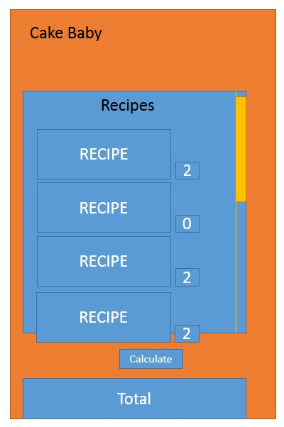

Assignment 1
======

### Objectives

- To demonstrate ability with introductory JavaScript and basic html/css elements
- To decompose an introductory user story into objects and working code
- To do the above without using JavaScript plugins or outside libraries

### Instructions

- You are to modify the included assignment1.html to provide the following functionality.
- Cake Baby Bakery would like an application to manage their daily baking schedule and the cost of each days baking. Cake Baby bakes several kinds of products, each product has a name and different list of ingredients. Each ingredient has a name, measurement (per product recipe), cost and supplier.
- You need to design a javascript recipe calculator – where employees can calculate how much ingredients to buy for a given weeks recipes.

#### Steps

- Build objects - either maps or object definitions– for products and ingredients – use arrays to store lists of objects
- Render the recipe lists using the objects from the supplied data via ajax from the supplied json file--i.e make new html on the page based on the json data
- Add an input field to each recipe list so the user can type in a number of that recipe that want to create for the week
- Add an onclick event to a button on the page - so that when clicked, it combines all the ingredients for all the recipes to calculate a total.
- Display that total on the page.

#### Graduate Extension

- You are required to create reusable objects definitions that are invoked with the new keyword e.g ( var myIngredient = new namespace.Ingredient(…, …., ….)  ) for products and recipes, instead of simply using maps
- You must enclose all definitions within a namespace
- The functions to render recipes to the page should be contained within the object definitions
- In addition to displaying the total cost, you must split the cost per supplier, and total the amount of each ingredient to be purchased from each supplier.

### Graded

To obtain maximum grades:

- Build all functionality entirely in JavaScript
- Attach all elements to the included hook on the page
- Have no JavaScript errors in console during operation
- Create a readme file explaining your submission

### Interface Wireframe

### Completed Assignment

[readme.pdf](readme.pdf)

### Grade

70/100 (Handed in late)

### Feedback

N/A