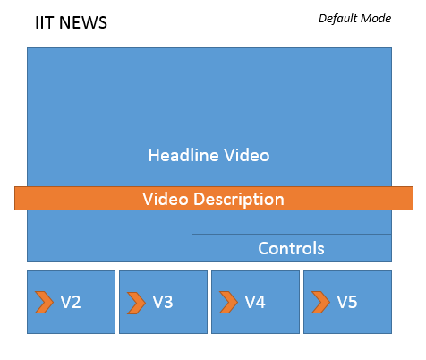

Assignment 2
======

### Objectives

- Use traditional and assisted AJAX techniques for asynchronously loading content
- Compare and contrast the use of jQuery animations and CSS3 animation features.
- Describe and use responsive design principles and techniques and explain the advantages of
responsive design as it relates to desktop and mobile web-based applications.
- Explain the functionality and develop applications that use the HTML5 Local Storage API for making
internet applications available when not connected to the internet
- Describe the use of the HTML5 Audio and Video APIs and compare and contrast the HTML5 APIs to
legacy audio and video solution

### Instructions

- You are to modify the included assignment2.html to provide the following functionality:
IIT News would like to design a rich new cross platform video application – you are designing the first version
of such a cross platform application by creating a JavaScript library that will create a custom video player that
will load a selection of movies and enable the user to select a movie to play. Videos will be displayed from the
day’s top headlines, and users should be able to pick one of the videos they have not scene before to view it
– and additional information about the video should become visible as the video plays. IIT News wants to
compete on the ease of use of its video player and has decided it must have the following features:
- Your application must show usage of the jQuery library
- The list of videos should be obtained from downloading and parsing the supplied AJAX file
- It should arrange the videos in random order on the page according to the general layout guideline
displayed below
    - Each video should display the thumbnail and the main video must also display the title
- The video description should appear on the video after the video has completed by 25% or more.
- The video description should use a css3 animation to slide in from the left
- You must store in localStorage what videos the user has watched on their browser and display those
at the end of the list (displaying unwatched videos first)
- You must implement a complete custom set of video player controls – including:
    - Play/Pause Button
    - Progress Bar
- The video’s should first display a thumbnail of the videos, using the supplied URL in the json file,
which – when clicked – will start the video playing.

### Graded

To obtain maximum grades:

- Build all functionality entirely in JavaScript
- Attach all elements to the included hook on the page
- Have no JavaScript errors in console during operation
- Create a readme file explaining your submission

### Interface Wireframe

### Completed Assignment

[readme.pdf](readme.pdf)

### Grade

98/100

### Feedback

N/A